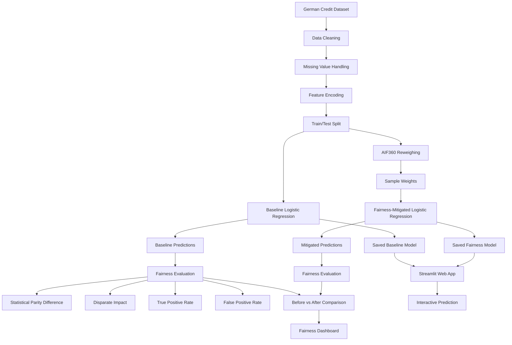

# ⚖️ AI Credit Risk Fairness Analyzer

A research-based machine learning project that investigates **fairness and bias in credit-risk prediction models** and evaluates whether preprocessing-based bias mitigation can reduce group-level disparities while maintaining predictive performance.

🔗 **Live Demo:** [Add your Streamlit URL here]

---

## 📌 Project Overview

Machine learning models can achieve reasonable predictive accuracy while still producing significantly different outcomes for different demographic groups.

This project explores that problem using a **German Credit Risk dataset**.

A Logistic Regression model is trained to predict whether an applicant represents:

* `Good` credit risk
* `Bad` credit risk

The model is then evaluated across **male and female applicants** using multiple fairness metrics.

A preprocessing-based **Reweighing** technique is subsequently applied to the training data, and a second model is trained using the resulting sample weights.

The project compares:

> **Baseline Model → Fairness Evaluation → Reweighing → Mitigated Model → Before/After Comparison**

---

## 🎯 Objectives

* Build a lightweight credit-risk classification model.
* Evaluate model performance on unseen data.
* Measure group-level fairness across gender.
* Apply a research-based bias mitigation technique.
* Compare fairness before and after mitigation.
* Deploy the complete system as an interactive Streamlit web application.

---

## 🧠 Research Basis

The project is primarily based on the preprocessing approach described by:

**Faisal Kamiran and Toon Calders**

> *Data preprocessing techniques for classification without discrimination*

Knowledge and Information Systems, 33, 1–33, 2012.

DOI: `10.1007/s10115-011-0463-8`

The paper investigates preprocessing approaches for classification without discrimination, including **reweighing**, where training examples are assigned different weights before classifier training.

A broader theoretical background was also taken from:

**Simon Caton and Christian Haas**

> *Fairness in Machine Learning: A Survey*

arXiv:2010.04053

---

## 🏗️ System Architecture



---

## 📊 Dataset

The project uses a **1,000-record German Credit dataset** containing applicant characteristics and a binary credit-risk target.

### Main features

* Age
* Sex
* Job
* Housing
* Saving accounts
* Checking account
* Credit amount
* Loan duration
* Purpose

### Target

`Risk`

* `good` → 1
* `bad` → 0

### Protected attribute

`Sex`

* Female
* Male

The dataset contains missing values in the categorical account-related fields. These were retained and represented using an `unknown` category rather than removing hundreds of observations.

---

## 🤖 Machine Learning Pipeline

### 1. Data preprocessing

* Removed the dataset index column.
* Handled missing categorical values.
* Separated features and target.
* Converted the target into binary numerical labels.
* Applied one-hot encoding to categorical variables.
* Split data into 80% training and 20% testing data.
* Applied feature scaling.

### 2. Baseline model

A lightweight **Logistic Regression** classifier was trained as the baseline.

Baseline test accuracy:

**73.5%**

### 3. Fairness mitigation

The training data was processed using **AIF360 Reweighing**.

Reweighing assigns different importance to training examples belonging to different combinations of:

* Protected group
* Target outcome

The resulting sample weights were then supplied to a second Logistic Regression model.

---

## ⚖️ Fairness Metrics

The project evaluates:

### Statistical Parity Difference (SPD)

Measures the difference in positive prediction rates between groups.

Values closer to **0** indicate greater parity.

### Disparate Impact (DI)

Compares the positive prediction rate of the unprivileged group with the privileged group.

A value closer to **1** indicates greater parity.

### True Positive Rate (TPR)

Measures how frequently the model correctly identifies positive cases within each group.

### False Positive Rate (FPR)

Measures how frequently the model incorrectly assigns the positive outcome to negative cases within each group.

---

## 📈 Results

### Baseline Model

| Metric              | Female |   Male |
| ------------------- | -----: | -----: |
| Accuracy            | 70.00% | 75.00% |
| Predicted Good Rate | 60.00% | 83.57% |
| True Positive Rate  | 72.50% | 91.00% |
| False Positive Rate | 35.00% | 65.00% |

**Statistical Parity Difference:** `-0.2357`

**Disparate Impact:** `0.7179`

---

### After Reweighing

| Metric              | Female |   Male |
| ------------------- | -----: | -----: |
| Accuracy            | 68.33% | 75.00% |
| Predicted Good Rate | 71.67% | 79.29% |
| True Positive Rate  | 80.00% | 88.00% |
| False Positive Rate | 55.00% | 57.50% |

**Statistical Parity Difference:** `-0.0762`

**Disparate Impact:** `0.9039`

Overall test accuracy changed from:

**73.5% → 73.0%**

---

## 🔎 Key Findings

Reweighing substantially reduced the observed group-level disparities.

| Metric              |   Before |       After |
| ------------------- | -------: | ----------: |
| SPD                 |  -0.2357 | **-0.0762** |
| Disparate Impact    |   0.7179 |  **0.9039** |
| Prediction-rate gap | 23.57 pp | **7.62 pp** |
| TPR gap             | 18.50 pp | **8.00 pp** |
| FPR gap             | 30.00 pp | **2.50 pp** |
| Overall Accuracy    |    73.5% |   **73.0%** |

The experiment therefore demonstrates a significant reduction in several measured disparities while causing only a small reduction in overall predictive accuracy.

---

## 🌐 Web Application

The project is deployed using **Streamlit Community Cloud**.

### Features

* Interactive applicant input form
* Baseline credit-risk prediction
* Fairness-mitigated prediction
* Good-risk probability
* Fairness metrics dashboard
* Before/after mitigation comparison
* Model-performance comparison
* Project methodology and limitations

The application loads pre-trained models rather than retraining them during user interaction.

---

## 🛠️ Technology Stack

**Programming**

* Python

**Machine Learning**

* Scikit-learn
* Logistic Regression

**Fairness**

* IBM AI Fairness 360 (AIF360)
* Reweighing
* Statistical Parity Difference
* Disparate Impact
* Equal Opportunity / TPR
* FPR

**Data**

* Pandas
* German Credit dataset

**Model Persistence**

* Joblib

**Deployment**

* Streamlit Community Cloud
* GitHub

---

## 📁 Project Structure

```text
ai-credit-risk-fairness-analyzer/
│
├── app.py
├── requirements.txt
├── README.md
├── .gitignore
│
├── fairness_models/
│   ├── baseline_model.pkl
│   ├── fairness_model.pkl
│   ├── preprocessor.pkl
│   └── scaler.pkl
│
└── assets/
    ├── app-home.png
    ├── fairness-dashboard.png
    └── architecture.png
```

---

## ⚠️ Limitations

This project is an educational and research-oriented demonstration and **must not be used for real-world credit decisions**.

Important limitations include:

* The dataset contains only 1,000 observations.
* Gender is treated as a binary protected attribute.
* The model is a relatively simple Logistic Regression classifier.
* Fairness metrics are statistical measurements and do not by themselves prove intentional discrimination.
* Results depend heavily on the dataset and evaluation sample.
* Reweighing can improve some fairness metrics while worsening others.
* Fairness involves trade-offs between multiple objectives; there is no universally optimal fairness metric.
* The system does not perform real-world creditworthiness verification.
* The application does not establish causal relationships between demographic attributes and model outcomes.

---

## 🚀 Future Improvements

Potential extensions include:

* Evaluate additional protected attributes.
* Compare multiple fairness mitigation techniques.
* Add threshold-based post-processing.
* Compare Logistic Regression with tree-based models.
* Add confidence intervals and statistical significance testing.
* Add explainable AI techniques such as SHAP.
* Evaluate the system on additional credit datasets.
* Add automated fairness reports.
* Add model monitoring for distribution shifts.

---

## 📚 References

1. Kamiran, F., & Calders, T. (2012). *Data preprocessing techniques for classification without discrimination*. Knowledge and Information Systems, 33(1), 1–33. DOI: 10.1007/s10115-011-0463-8.

2. Caton, S., & Haas, C. (2020). *Fairness in Machine Learning: A Survey*. arXiv:2010.04053.

3. Bellamy, R. K. E., et al. (2019). *AI Fairness 360: An Extensible Toolkit for Detecting, Understanding, and Mitigating Unwanted Algorithmic Bias*. IBM Research.

---

## 👨‍💻 Author

**[Your Name]**

Built as a research-to-project implementation exploring fairness-aware machine learning and responsible AI.

---

## ⭐ If you found this project useful

Feel free to star the repository and explore the live demo.

```
```
